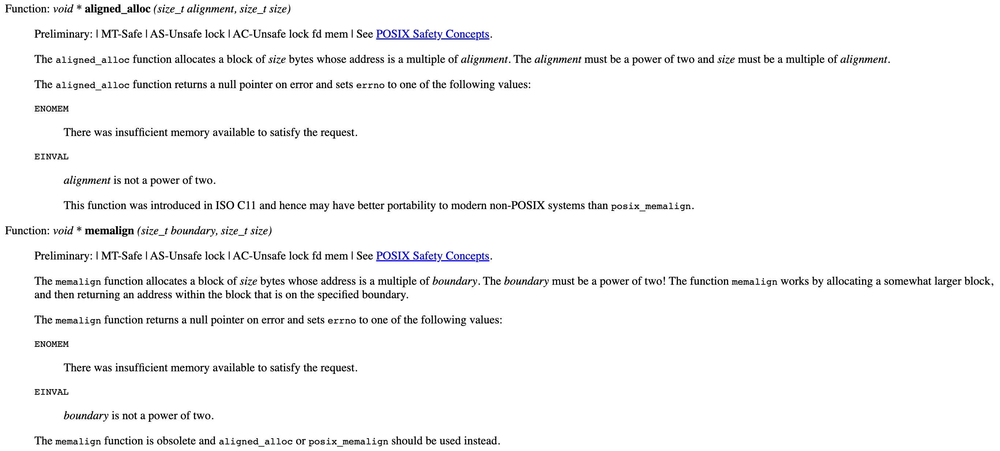
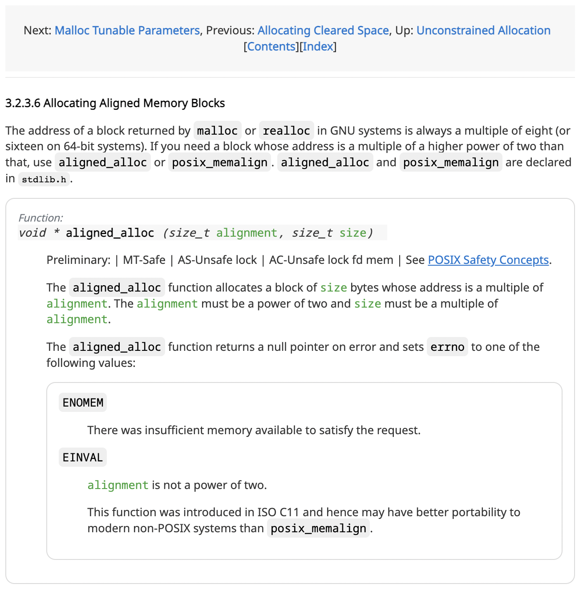

## Info

- Browser Extension/Add-on: [stylus](https://github.com/openstyles/stylus/)
- Download the custom style here: https://userstyles.world/style/6257/gnu-libc-water-style.

Stylus is a fork of stylish. It applies user-defined style sheets to websites.

Before:



After:



## Motivation

The default styling on GNU's glibc isn't great.
It has no container: one line of text can be as long as
the ultrawide cinema screen.
Code blocks and sections don't have enough contrast to other text.
The font family for code blocks is not monospace.

## Technologies

To get a beautiful page with minimal effort, we need to use CSS frameworks.

### Frameworks like Bootstrap Aren't the Easiest

However, most of the popular CSS frameworks aren't going to be the best choices.

For example, to work with Bootstrap, we need to add a lot of
component classes/utility classes.
Here's a code snippet from the [bootstrap official documentation](https://getbootstrap.com/docs/5.2/components/list-group/#basic-example):

```html
<ul class="list-group">
  <li class="list-group-item">An item</li>
  <li class="list-group-item">A second item</li>
  <li class="list-group-item">A third item</li>
  <li class="list-group-item">A fourth item</li>
  <li class="list-group-item">And a fifth one</li>
</ul>
```

Notice the class attribute of each element here.

Here is [part of the glibc HTML](./https://www.gnu.org/software/libc/manual/html_node/Program-Basics.html).

```html
<ul class="section-toc">
  <li><a href="Program-Arguments.html" accesskey="1">Program Arguments</a></li>
  <li>
    <a href="Getopt.html" accesskey="2"
      >Parsing program options using <code>getopt</code></a
    >
  </li>
  <li>
    <a href="Argp.html" accesskey="3">Parsing Program Options with Argp</a>
  </li>
  <li>
    <a href="Environment-Variables.html" accesskey="4">Environment Variables</a>
  </li>
  <li><a href="Auxiliary-Vector.html" accesskey="5">Auxiliary Vector</a></li>
  <li><a href="System-Calls.html" accesskey="6">System Calls</a></li>
  <li>
    <a href="Program-Termination.html" accesskey="7">Program Termination</a>
  </li>
</ul>
```

In order to use bootstrap's styles for this list group, we need to add a lot of classes.

```html
<ul class="section-toc list-group">
  <li class="list-group-item">
    <a href="Program-Arguments.html" accesskey="1">Program Arguments</a>
  </li>
  <li class="list-group-item">
    <a href="Getopt.html" accesskey="2"
      >Parsing program options using <code>getopt</code></a
    >
  </li>
  <li class="list-group-item">
    <a href="Argp.html" accesskey="3">Parsing Program Options with Argp</a>
  </li>
  <li class="list-group-item">
    <a href="Environment-Variables.html" accesskey="4">Environment Variables</a>
  </li>
  <li class="list-group-item">
    <a href="Auxiliary-Vector.html" accesskey="5">Auxiliary Vector</a>
  </li>
  <li class="list-group-item">
    <a href="System-Calls.html" accesskey="6">System Calls</a>
  </li>
  <li class="list-group-item">
    <a href="Program-Termination.html" accesskey="7">Program Termination</a>
  </li>
</ul>
```

The same idea applies to other class-based frameworks, including
Tailwind CSS, MUI, Foundation, etc.

### Frameworks for HTML elements

There are frameworks that apply styles based on HTML elements.
Some might call them ["class-less" CSS frameworks](https://github.com/troxler/awesome-css-frameworks#class-less).

I decide to give `Water.css` a try.

### Water CSS

After applying Water.css, the site is immediately prettier.

You can try it yourself by adding the CDN link in the head section of the html.
Just open the developer tool, and right click the `<head>` tag, select
"Edit as HTML" and add `<link rel="stylesheet" href="https://cdn.jsdelivr.net/npm/water.css@2/out/water.css">` in side.

I added some custom borders, fonts and other tweaks to the default Water theme.
They're not perfect yet and please let me know if you have any suggestion.

